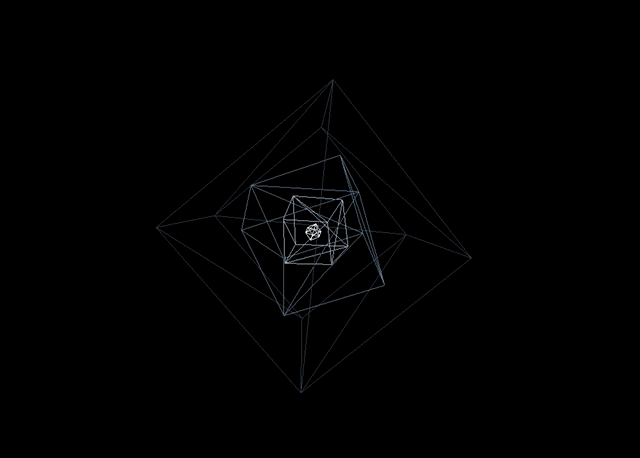

<header>
    <link rel="stylesheet" href="https://cdn.jsdelivr.net/gh/devicons/devicon@v2.15.1/devicon.min.css">
</header> 

<body>
  

    
  

  
  

     
    · 
    <a href="https://github.com/B-Salinas/resume-pdfs/blob/main/2022-11-Salinas-SoftwareEngineer-Resume.pdf">Latest Resume</a>  
    · 
    <a href="https://github.com/B-Salinas/B-Salinas/blob/main/more.md">About B</a> 
    ·
    <a href="https://github.com/B-Salinas/github-should-have-a-blog">My Thoughts</a>
    ·
    ✊🏽✊🏾✊🏿 🇲🇽 🇺🇸 🏳️‍🌈
  

  

 
  

    
    
    
    
    <!--  -->
    <!--  -->
    
    
    
    
    
    
    
    <!--  -->
        
    
     
    
      
    
    
    
    
    
    
    
    <!-- 
    
     -->
  
   
</body>
